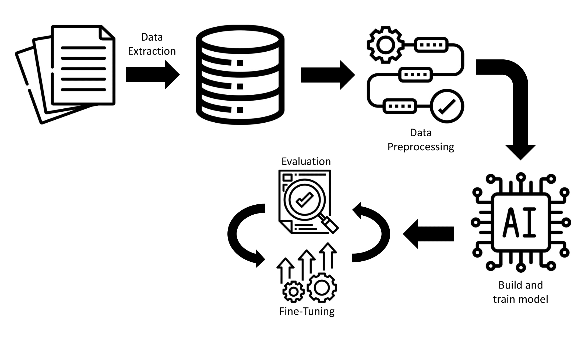

# Visitor-prediction

<figure>
    
</figure>

**Project description:**

For the project in "Selected Topics of AI" we decided to make a visitor forecast for the BWI library (library of the Institute of Business Administration) at the University of Stuttgart.

In the BWI library, the number of visitors is recorded every day (Monday - Friday). This is done in the form of "visitor statistics". In the visitor statistics, visitors are recorded in eight different time periods: `09:30`, `10:45`, `13:45`, `16:15`, `17:45`, `18:00`, `18:30` and `18:45`. Due to the library's opening hours (Mon. - Thurs. 09:00-19:00; Fri. 09:00 - 17:00), the last three time periods are not recorded on Fridays.

**Data:** Visitor statistics from the BWI library, which are available in analogue form. Since the data is recorded by hand on paper, the data must be digitized for the first time. This is done by manually filling in a pre-generated Excel table (see `data/dataset_creator.ipynb`).

**Goal:** The goal of this project, and the AI model, is to predict the number of visitors for the coming day.

**Method:** To achieve the goal, an LSTM model is trained and fine-tuned.

<figure>
    
</figure>

Source: own creation (Patryk Gadziomski)

